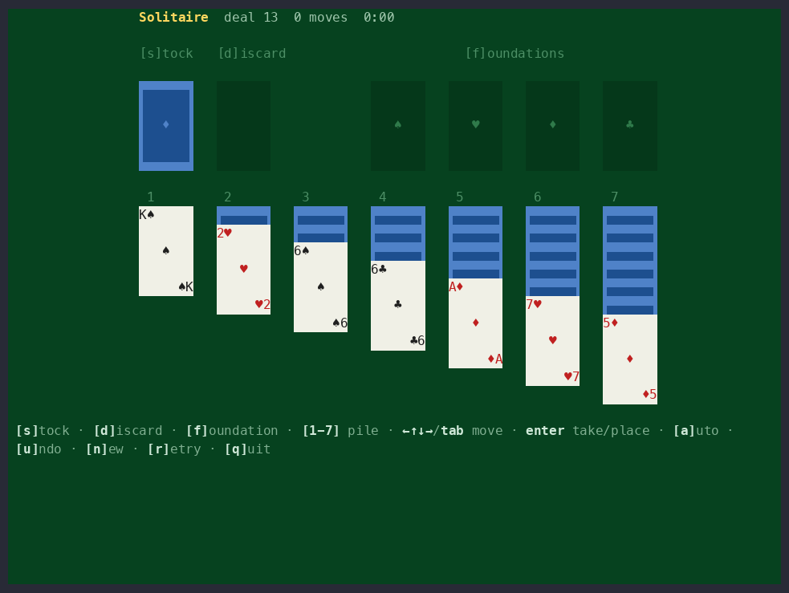

# TermDOM

**Build terminal apps with HTML, CSS and the DOM.**



TermDOM is a JavaScript library that displays HTML and CSS in the terminal. It
draws actual DOM nodes to terminal output and redraws the screen when the nodes
are mutated, so TUIs and interactive CLIs can be written with vanilla
JavaScript or any frontend web framework.

```sh
npm install @b9g/termdom
```

```ts
import {TermDOM} from "@b9g/termdom";

const term = new TermDOM();
term.attach();

// The document is a real DOM document.
const {document} = term;
document.body.innerHTML = `
  <style>
    .card { border: 1px solid #5fafff; padding: 0 1ch; width: 36ch; }
    .title { color: #5fafff; font-weight: bold; }
    .done { color: green; }
    .rest { color: #444; }
    .pct { color: #888; }
  </style>
  <div class="card">
    <div class="title">Installing</div>
    <div>
      <span class="done" id="done"></span><span class="rest" id="rest"></span>
      <span class="pct" id="pct"></span>
    </div>
  </div>
`;

// TermDOM observes mutations and re-renders automatically.
let n = 0;
setInterval(() => {
  n = (n + 1) % 101;
  const cells = Math.round(n / 4);
  document.getElementById("done").textContent = "█".repeat(cells);
  document.getElementById("rest").textContent = "░".repeat(25 - cells);
  document.getElementById("pct").textContent = String(n).padStart(3) + "%";
}, 50);
```


## Features

- **Stylesheets** CSS from `<style>` elements and `style` attributes cascades
  and inherits as in the browser, translated to ANSI color and decoration.
- **Layout** The CSS box model, flexbox, and table layout, computed in whole
  terminal cells with margins, borders, and padding.
- **Scrolling** Documents taller than the terminal scroll with
  `window.scrollTo()` and `element.scrollIntoView()`.
- **Events** Keyboard, mouse, focus, and paste events fire on elements, the
  document, and the window, decoded from stdin.
- **DOM utilities** `document.querySelector()`, `MutationObserver`,
  `ResizeObserver`, and `getBoundingClientRect()` work and report
  cell-based layout.
- **Forms** `<input>`, `<textarea>`, `<select>`, checkboxes, and radios have
  terminal-native looks, restylable with CSS; Tab and `:focus` work.
- **Web Components** `customElements.define()`, `attachShadow()`, `<slot>`,
  `:host`, and scoped styles; the built-in controls are shadow trees.
- **Text** CJK, emoji, and combining characters take correct widths; Hebrew
  and Arabic render in visual order with contextual shaping.
- **Selection** Drag to select, styled with `::selection`; the caret moves
  by grapheme, and text fields bind the readline chords (Ctrl+A/E/K/U/W).
- **Fullscreen** `Element.requestFullscreen()` renders to the alternate
  screen; exiting restores the shell and its scrollback.

## How it works

TermDOM implements the browser's rendering pipeline against a grid of character
cells instead of pixels. All CSS lengths resolve to cells (`1px` and `1ch` are
both one cell). On each frame the engine recomputes style and layout for
whatever mutated, paints the result into a cell buffer, diffs it against the
previous frame, and writes the difference to stdout as ANSI escape sequences.
Escape sequences from stdin are decoded into keyboard, mouse, and paste events
and dispatched to DOM nodes.

## Examples

- [`markdown.ts`](./examples/markdown.ts) — a Markdown viewer that pages
  when the document is taller than the terminal.
- [`chat.ts`](./examples/chat.ts) — a streaming LLM chat client powered by
  [ch.at](https://ch.at), with a transcript and composer.
- [`todomvc.ts`](./examples/todomvc.ts) — the official TodoMVC with its
  component logic unmodified; only the stylesheet was swapped.
- [`fuzzy-finder.ts`](./examples/fuzzy-finder.ts) — a file picker that
  prints the selection to stdout.
- [`weather.ts`](./examples/weather.ts) — an emoji forecast from
  Open-Meteo, with a city search and flexbox day cards.
- [`popover.ts`](./examples/popover.ts) — a menu bar where every menu is
  a declarative popover; open, dismiss and stacking are the platform's.
- [`solitaire.ts`](./examples/solitaire.ts) — the Klondike solitaire above,
  with seeded deals playable by keyboard or mouse.
- [`hello-{react,vue,svelte,crank}.ts`](./examples) — one greeting and
  keypress counter apiece, each driving that framework's stock renderer.

More runnable examples can be found in [`examples/`](./examples). Most of
them also run in the browser at
[termdom.org/playground](https://termdom.org/playground/), from the same
files.

## Runtimes

TermDOM runs on Node, Bun and Deno. The library has no native components and
can be used to create binaries with tools like `bun build --compile`.

## Compatibility

[COMPATIBILITY.md](./COMPATIBILITY.md) is generated by probing each feature
against the engine.

## Name

Not to be confused with [DomTerm](https://domterm.org) by Per Bothner, a terminal
emulator built out of DOM elements. The two projects are each
other's inverse: DomTerm puts a terminal in the DOM; TermDOM puts the DOM
in a terminal.

## License

MIT
