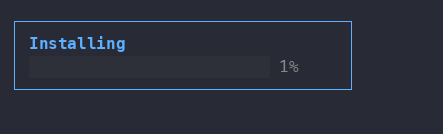

# TermDOM

**Build terminal apps with HTML, CSS and the DOM.**

TermDOM is a JavaScript library that displays HTML and CSS in the terminal. It
draws actual DOM nodes to terminal output and redraws the screen when they
mutate, so TUIs and interactive CLIs can be written with vanilla JavaScript or
any frontend web framework.

```sh
npm install @b9g/termdom
```

```ts
import {TermDOM} from "@b9g/termdom";

const term = new TermDOM();
term.attach();

// The document is a real DOM document.
const {document} = term;
document.body.innerHTML = `
  <style>
    .card { border: 1px solid #5fafff; padding: 0 1ch; width: 36ch; }
    .title { color: #5fafff; font-weight: bold; }
    .done { color: green; }
    .rest { color: #444; }
    .pct { color: #888; }
  </style>
  <div class="card">
    <div class="title">Installing</div>
    <div>
      <span class="done" id="done"></span><span class="rest" id="rest"></span>
      <span class="pct" id="pct"></span>
    </div>
  </div>
`;

// TermDOM observes mutations and re-renders automatically.
let n = 0;
setInterval(() => {
  n = (n + 1) % 101;
  const cells = Math.round(n / 4);
  document.getElementById("done").textContent = "█".repeat(cells);
  document.getElementById("rest").textContent = "░".repeat(25 - cells);
  document.getElementById("pct").textContent = String(n).padStart(3) + "%";
}, 50);
```



## Features

- **Stylesheets** CSS from `<style>` elements and `style` attributes cascades
  and inherits like it does in the browser, and is translated to ANSI escapes
  for color and text decoration.
- **Layout** The CSS box model, flexbox, and table layout are all supported.
- **Scrolling** Documents taller than the terminal scroll with
  `window.scrollTo()` and `element.scrollIntoView()`.
- **Events** Events for keys, mouse, focus, and paste fire on elements, the
  document, and the window, pulled from STDIN.
- **DOM utilities** `document.querySelector()`, `MutationObserver`,
  `ResizeObserver`, and `Element.getBoundingClientRect()` are hooked up to
  the layout engine and viewport, following browser standards.
- **Forms** `<input>`, `<textarea>`, `<select>`, checkboxes, and radios come
  with default behavior and terminal-native looks, and can be restyled with
  ordinary CSS. Tab navigation and `:focus` styles are supported.
- **Web Components** `customElements.define()`, `attachShadow()`, `<slot>`,
  `:host`, and scoped styles behave like the browser's. The built-in form
  controls are themselves shadow trees.
- **Text** CJK, emoji, and combining characters take their correct widths.
  Hebrew and Arabic render in visual order with contextual shaping, and the
  caret moves by grapheme.
- **Selection** Drag to select, styled with `::selection`.
- **Fullscreen** `Element.requestFullscreen()` renders an element to the
  alternate screen. Exiting restores the shell and its scrollback.

## Examples

- [`markdown.ts`](./examples/markdown.ts) — a Markdown viewer that pages
  when the document is taller than the terminal.
- [`chat.ts`](./examples/chat.ts) — a streaming LLM chat client powered by
  [ch.at](https://ch.at), with a transcript and composer.
- [`todomvc.ts`](./examples/todomvc.ts) — the official TodoMVC with its
  component logic unmodified; only the stylesheet was swapped.
- [`fuzzy-finder.ts`](./examples/fuzzy-finder.ts) — a file picker that
  prints the selection to stdout.
- [`solitaire.ts`](./examples/solitaire.ts) — Klondike, played with the
  mouse or the keyboard; the board is flex rows and columns of styled spans.

More runnable examples can be found in [`examples/`](./examples).

## Runtimes

TermDOM runs on Node, Bun and Deno. The library has no native components and
can be used to create binaries with tools like `bun build --compile`.

## Compatibility

[COMPATIBILITY.md](./COMPATIBILITY.md) is generated by probing each feature
against the engine.

## License

MIT
